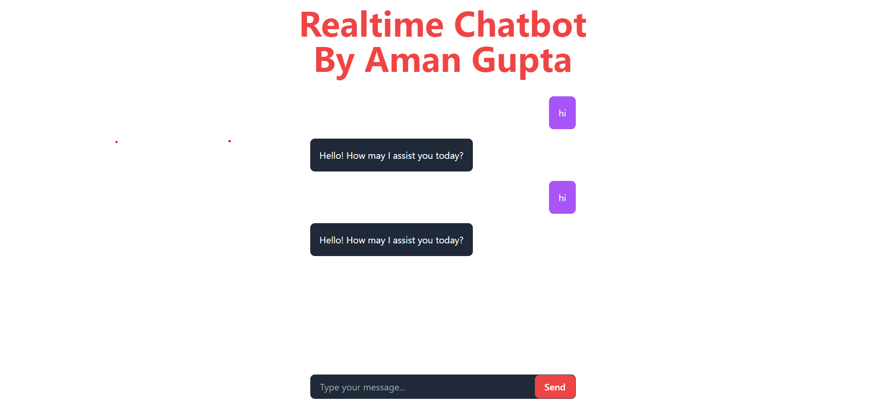

<h1 align="center">Chatbot Project using Next.js, Tailwind CSS, and OpenAI API</h1>

  Welcome to the Chatbot Project developed by Aman Gupta as part of a challenge from the Orangewood Company. This project demonstrates the creation of an interactive chatbot that engages in natural conversations with users. The chatbot is designed to provide intelligent and contextually relevant responses to user inputs.

## Features

- **Conversational Flow:** The chatbot engages in natural conversations, understanding context and providing relevant responses based on previous messages.
- **Dynamic UI:** The Next.js framework enables a dynamic user interface that updates in real-time as the conversation progresses.
- **Responsive Design:** The chatbot interface is designed using Tailwind CSS to ensure seamless functionality across different devices and screen sizes.
- **Intelligent Responses:** Leveraging the OpenAI API, the chatbot generates responses that closely resemble human language, enhancing the user experience.

## Technology Stack

- **Frontend:** Next.js
- **Styling:** Tailwind CSS
- **API:** OpenAI API
- **HTTP Requests:** Axios

## Installation

1. Clone this repository to your local machine.
2. Navigate to the project directory: `cd chatbot`.
3. Obtain an API key from the [OpenAI API](https://beta.openai.com/signup/).
4. In the project directory, create a `.env.local` file and add your API key as follows:

OPENAI_API_KEY=your-api-key

5. Install project dependencies: `npm install`.

## Usage

1. Start the development server: `npm run dev`.
2. Access the chatbot in your browser at `http://localhost:3000`.

## Acknowledgements

I would like to express my gratitude to the Orangewood Company for providing the opportunity to work on this project and explore the capabilities of Next.js, Tailwind CSS, and the OpenAI API.

## Contact

If you have any questions or feedback regarding this project, feel free to reach out to me at [your-email@example.com](mailto:your-email@example.com).
